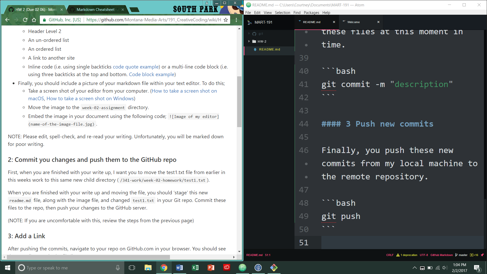

# Homework 2 Assignment

## Courtney Thomas

## This week's workflow

This week, I had the following workflow as I worked on the assignment;

1. Downloaded software
2. Attended office hours
3. Did Homework 2
  - Learned how to create;
    - Headers
    - Lists
    - Link to another site
  - Continued to learn Git and GitHub

## Resources I used for Homework 2

This week I had to use many resources besides attending office hours, one of them being the [markdown cheatsheet](https://github.com/adam-p/markdown-here/wiki/Markdown-Cheatsheet).

## Weekly Problems

One of the things that was a problem for me this week, was figuring out how to upload to GitHub.

I had to remind myself that it is a three step process.

#### 1 stage files

The first, begin by staging the files

```bash
git stage *
```

#### 2 Commit stage files

After staging files, we commit the changes. By committing, you are storing information from these files at this moment in time.

```bash
git commit -m "description"
```

#### 3 Push new commits

Finally, you push these new commits from my local machine to the remote repository.

```bash
git push
```

## Mandatory Screenshot


